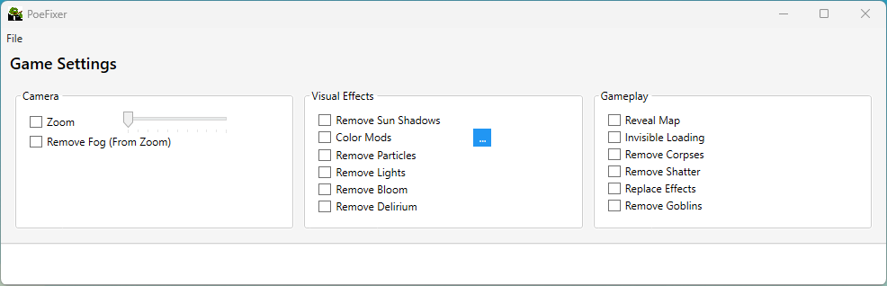
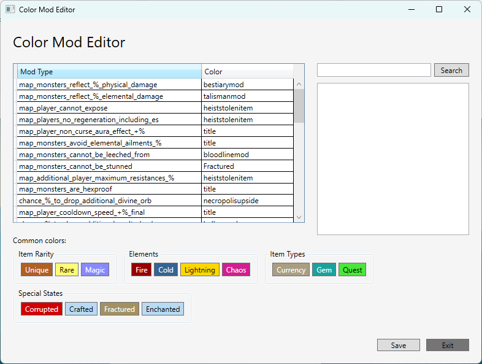

# PoeFixer

A modernized UI version of [SneedSmoother](https://github.com/glutzer/SneedSmoother/), a Path of Exile tool for modifying game assets, particularly UI modifications.

## Screenshots

### Main Window


### Color Mod Editor


## Features

- GGPK file handling and patching
- Asset extraction and restoration
- Modern, organized UI with grouped settings
- Camera controls (zoom, fog)
- Visual effects customization
- Gameplay modifications

## Recent Updates

### UI Improvements
1. Color Mod Editor
   - Added search functionality for mod descriptions
   - Multi-select support with keyboard shortcuts
   - Context menu for adding/removing items
   - Status notifications for actions
   - Unsaved changes tracking
   - Auto-sizing window

2. Main Window
   - More compact layout
   - Reduced window height
   - Streamlined settings panel
   - Status bar for console output (3 lines)
   - Improved spacing and margins

### Keyboard Shortcuts
- **Color Mod Editor**
  - Enter: Add selected items
  - Ctrl+A: Select all items
  - Delete: Remove selected items
  - Ctrl+S: Save changes

### Technical Changes
- Improved error handling
- Better memory management
- More efficient UI updates
- Enhanced status feedback

## Changes from Original SneedSmoother

### UI Modernization
- Implemented a clean, organized layout
- Grouped settings into logical categories:
  - Camera Settings
  - Visual Effects
  - Gameplay Options
- Improved menu organization with File operations
- Enhanced console output display

### Visual Improvements
- Modern color scheme with blue accents
- Better typography and spacing
- Organized controls in GroupBoxes
- Improved visual hierarchy
- Better button styling and interactions

### Technical Improvements
- Maintained all original functionality
- Improved code organization
- Enhanced user feedback through console
- Better window layout management

## Usage

1. Select your GGPK file using File > Select GGPK
2. Use File > Patch GGPK to apply your settings
3. Extract or restore vanilla assets as needed
4. Adjust settings in the various categories as desired

## Building

```bash
dotnet build
```

## Running

```bash
dotnet run
```

## Requirements

- .NET 8.0 or later
- Path of Exile installation
- packcheck.exe (for asset verification)

## Credits

This is a UI modernization of [SneedSmoother](https://github.com/glutzer/SneedSmoother/) by glutzer. All core functionality remains the same, with improvements focused on user interface and experience.
